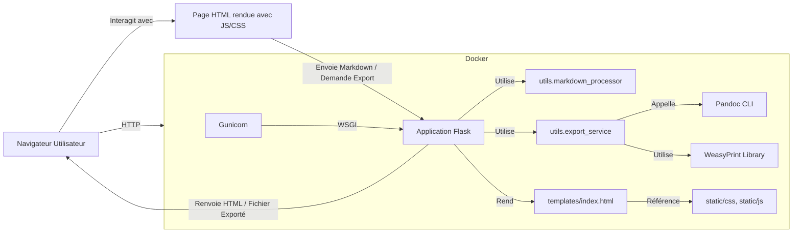

# Plan de Développement : Application Markdown Viewer & Exporter

**Objectif :** Créer une application web conteneurisée avec Docker, basée sur Flask et Gunicorn, permettant de coller du Markdown, de l'afficher avec un formatage soigné (thèmes clair/foncé) et de l'exporter en HTML, PDF, ou format LibreOffice (ODT).

## 1. Technologies Clés :

*   **Backend :** Python 3.x
*   **Framework Web :** Flask
*   **Serveur WSGI :** Gunicorn (pour la production dans Docker)
*   **Parsing Markdown :** `markdown-it-py` (flexible, supporte les extensions CommonMark, bon pour la coloration syntaxique si besoin)
*   **Génération PDF :** `WeasyPrint` (convertit HTML+CSS en PDF, ce qui permet de réutiliser les styles de l'aperçu web pour un rendu fidèle)
*   **Génération ODT (et potentiellement autres) :** `Pandoc` (outil en ligne de commande puissant, sera inclus dans l'image Docker)
*   **Templating HTML :** Jinja2 (intégré à Flask)
*   **Frontend :** HTML5, CSS3, JavaScript (vanilla JS pour la simplicité, notamment pour le changement de thème)
*   **Conteneurisation :** Docker

## 2. Structure du Projet Proposée :

```
markdownview/
├── app/                     # Module principal de l'application Flask
│   ├── __init__.py          # Factory de l'application Flask
│   ├── routes.py            # Logique des routes et des vues
│   ├── static/              # Fichiers statiques (CSS, JS, images)
│   │   ├── css/
│   │   │   ├── style.css        # Styles globaux
│   │   │   ├── theme-light.css  # Thème clair
│   │   │   └── theme-dark.css   # Thème foncé
│   │   └── js/
│   │       └── main.js          # JavaScript pour l'interactivité (ex: switch de thème)
│   ├── templates/           # Templates HTML (Jinja2)
│   │   └── index.html         # Page principale de l'application
│   └── utils/               # Modules utilitaires
│       ├── __init__.py
│       ├── markdown_processor.py # Logique de conversion Markdown vers HTML
│       └── export_service.py     # Logique pour gérer les exports (PDF, ODT)
├── Dockerfile               # Instructions pour construire l'image Docker
├── requirements.txt         # Dépendances Python du projet
├── run.py                   # Point d'entrée pour lancer l'application (développement/Gunicorn)
└── README.md                # Description du projet (à enrichir)
```

## 3. Fonctionnalités et Implémentation (grandes lignes) :

*   **`app/__init__.py` :**
    *   Fonction `create_app()` pour initialiser et configurer l'instance Flask.
*   **`app/routes.py` :**
    *   Route `/` (GET) : Affiche `index.html`.
    *   Route `/render` (POST, potentiellement via AJAX) : Prend le texte Markdown en entrée, le convertit en HTML via `markdown_processor.py` et renvoie le HTML.
    *   Route `/export/<format_type>` (POST) :
        *   Prend le texte Markdown en entrée.
        *   Utilise `export_service.py` pour générer le fichier demandé (`html`, `pdf`, `odt`).
        *   Renvoie le fichier généré pour téléchargement.
*   **`app/utils/markdown_processor.py` :**
    *   Fonction `to_html(markdown_text)` utilisant `markdown-it-py`.
*   **`app/utils/export_service.py` :**
    *   `export_html(markdown_text)` : Renvoie le HTML généré par `markdown_processor`.
    *   `export_pdf(markdown_text)` :
        1.  Génère le HTML.
        2.  Crée une page HTML complète (avec les CSS nécessaires pour le rendu) à partir de ce HTML.
        3.  Utilise `WeasyPrint` pour convertir cette page HTML en un flux binaire PDF.
    *   `export_odt(markdown_text)` :
        1.  Appelle `pandoc` en sous-processus (`subprocess.run`).
        2.  Commande : `pandoc --from=markdown --to=odt --output=-` (lit depuis stdin, écrit sur stdout).
*   **`app/templates/index.html` :**
    *   Un `<textarea>` pour l'entrée Markdown.
    *   Un `<div>` pour l'aperçu du HTML rendu.
    *   Boutons pour "Exporter en HTML", "Exporter en PDF", "Exporter en ODT".
    *   Bouton/Switch pour basculer entre thème clair et thème foncé.
*   **`app/static/js/main.js` :**
    *   Gestion du changement de thème (ajout/suppression de classes CSS sur `<body>`, sauvegarde de la préférence dans `localStorage`).
    *   Optionnel : mise à jour de l'aperçu en temps réel via une requête AJAX vers `/render` lors de la saisie dans le `<textarea>`.
*   **`app/static/css/` :**
    *   `style.css` : Styles de base, mise en page.
    *   `theme-light.css` & `theme-dark.css` : Variables de couleur et styles spécifiques à chaque thème.
*   **`Dockerfile` :**
    1.  Base : Image Python officielle (ex: `python:3.10-slim`).
    2.  Installation des dépendances système : `pandoc` et les bibliothèques requises par `WeasyPrint` (ex: `libpango-1.0-0`, `libcairo2`, `libgdk-pixbuf2.0-0`). La liste exacte dépendra de la distribution de base de l'image.
    3.  Copie de `requirements.txt` et installation des dépendances Python (`pip install -r requirements.txt`).
    4.  Copie des fichiers de l'application.
    5.  Configuration de l'utilisateur (non-root pour la sécurité).
    6.  Exposition du port (ex: 5000).
    7.  `CMD ["gunicorn", "--bind", "0.0.0.0:5000", "run:app"]` (où `app` est l'instance Flask créée dans `run.py` ou via la factory).
*   **`requirements.txt` :**
    ```
    Flask
    gunicorn
    markdown-it-py
    WeasyPrint
    ```
*   **`run.py` :**
    ```python
    from app import create_app

    app = create_app()

    if __name__ == "__main__":
        # Utilisé pour le développement local, Gunicorn sera utilisé en production via Dockerfile
        app.run(host='0.0.0.0', port=5000, debug=True)
    ```

## 4. Diagramme d'Architecture Simplifié :



## 5. Points d'Attention :

*   **Dépendances de WeasyPrint :** L'installation des dépendances système pour WeasyPrint dans le Dockerfile peut être un peu délicate et dépend de l'image de base Linux choisie. Il faudra consulter la documentation de WeasyPrint.
*   **Gestion des erreurs :** Prévoir une gestion propre des erreurs (ex: si Pandoc échoue).
*   **Sécurité :** S'assurer que le HTML généré à partir du Markdown est correctement "sanitized" si le Markdown peut provenir de sources non fiables (bien que pour un usage personnel, le risque soit moindre). `markdown-it-py` a des options pour cela.
*   **Performance pour les gros documents :** Pour des documents Markdown très volumineux, les conversions (surtout PDF et ODT) pourraient prendre du temps. Pour l'instant, nous partons sur un traitement synchrone.